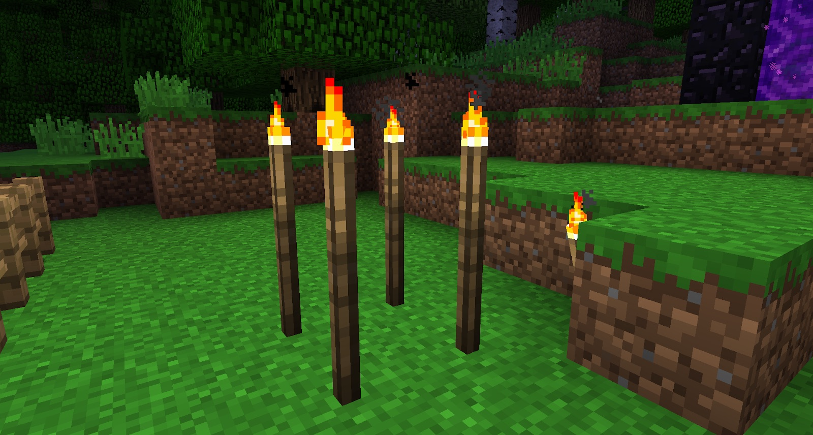

Sticks can be made into shafts. These can be placed on the ground and are great for marking areas of interest. You can right-click on the very top of the Shaft to place down torches. These should be used to your advantage, in case you die or get lost:

