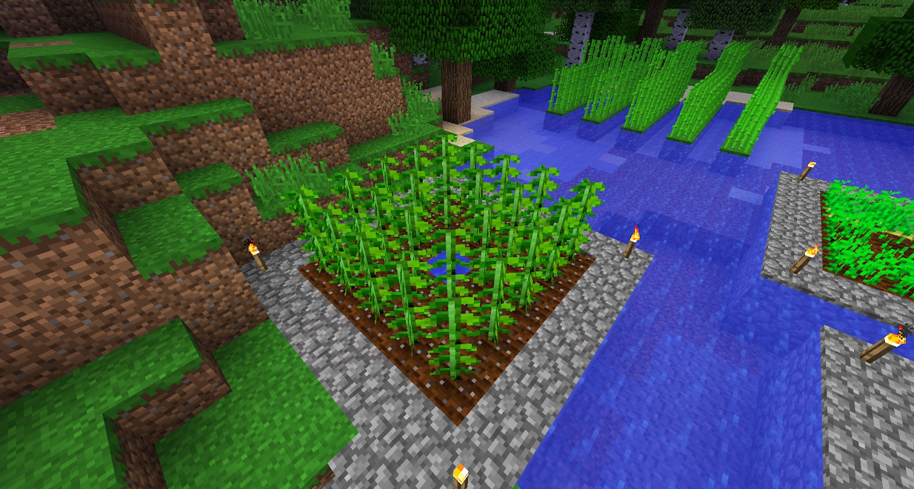
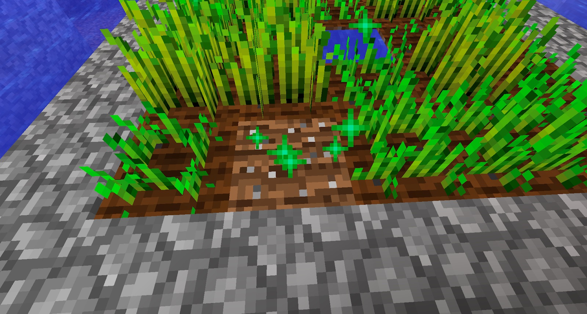
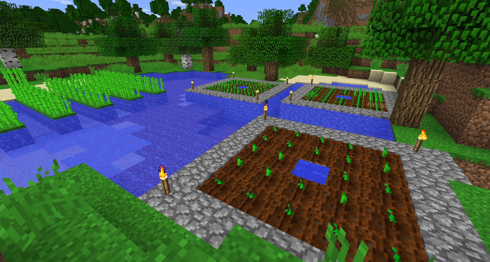

Craft an Iron Hoe and use it on grass to get Hemp seeds. You will need Hemp later on, so it’s best to plant as much as possible, as quick as possible, because Hemp grows very slowly.

You can use Bone Meal to speed up the growing process, but you have plenty to do, so you are better off planting and leaving them. When the Hemp plants are mature you will notice that they are 2 blocks tall. When harvesting, ensure that you only harvest the **TOP** block. This will grow back and is quicker than regrowing Hemp from a seed:

Above, you can see that the soil has white spots on it. This is fertile soil and will speed up the growing process. You can make any tilled earth fertile by right-clicking it with bone meal:

It is a good idea to plant a few other crops, such as Sugar Cane, Potatoes and Wheat. This will give you a steady supply of food, and these will be used later on:

