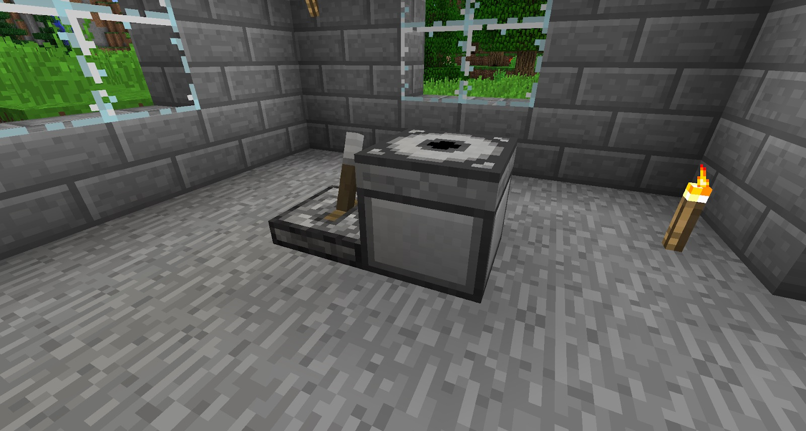
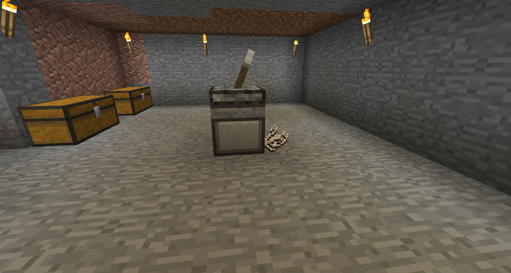
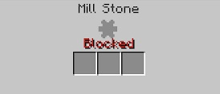

Craft a few gears, a Hand Crank and a Mill Stone. These enable you to process some key materials. Place the Mill Stone down, and then place a Hand Crank next to the Mill Stone:

When you right-click the Hand Crank, the Mill Stone will have smoke particles coming out of it. This means it is working. The Hand Crank will move back into its starting position. Each time you use the Hand Crank, you will deplete your hunger. When the Mill Stone has completed crafting, it will spit out its products into the world on a random side:

You can place the Hand Crank on top of the Mill Stone, and you can block off one side of Mill Stone. If you block off more than once face, it will become “Blocked”, meaning it will not work and you will not be able to use the Hand Crank:

This is a temporary setup. This is slow and will deplete your hunger. If you deplete your hunger too much, you will be too tired to use the Hand Crank:

