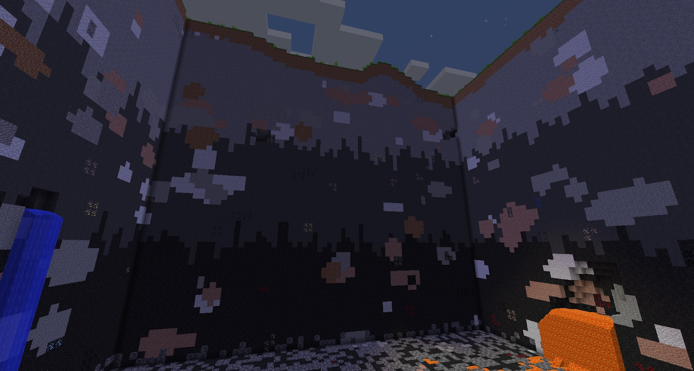

Do a lot of mining because Iron is used a lot in this mod. Iron is more valuable because, for the first half of this mod, you can only smelt Iron Ore into Iron Nuggets. You will be able to smelt iron ore into Iron Ingots later in the mod via the kiln. 

It is important that you use Iron Ore sparingly. There are a few items you need to make: a Bucket (this can be made with Nuggets), Flint and Steel (also can be made with Nuggets) and an Iron Pickaxe.

Your first Iron Pickaxe should be used to mine Diamonds, Gold, Redstone and to go deeper in the world (your priority is at least 3 Diamonds).

By default, the world will have 3 levels of strata. The deeper you dig, the harder the rock gets. It's still stone, and you can still mine it with a Stone Pickaxe, but it will take longer to mine the deeper you go.

By default this can not be seen, but with the help of the [Connected Textures Mod](https://minecraft.curseforge.com/projects/ctm), it can be made very clear:

The light grey is normal stone, the second layer is also stone, but much harder and the final layer, which is almost black, is harder still.

Once you get down to the second strata, an Iron Pickaxe will be your best bet. The best strategy is to go spelunking in caves to save time and resources.

You can mine any material with an Iron Pickaxe, and stone with Stone Pickaxes. You should make a few of these, as you might be mining for a while. Keep in mind that Stone Pickaxes only have 6 uses.
