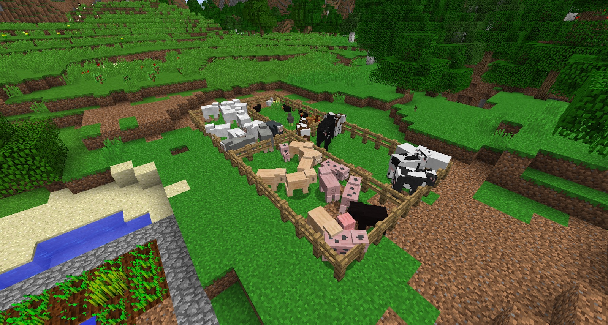

Before you get into any kind of automation, we suggest you make a pair of Shears. These will be useful when encountering Creepers. When sheared, creepers lose their ability to explode, and drop a “Creeper Oyster”. Collect a few of these; they will be needed later on.

Lastly, start breeding pens for Cows, Sheep, Pigs and Chickens. Cows are the highest priority because you need a decent supply of leather:

