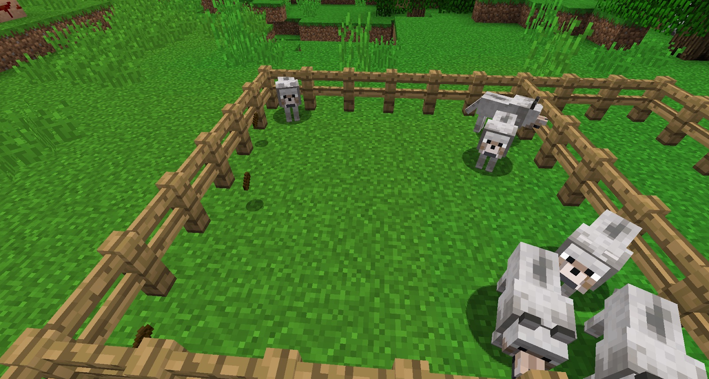

Dung can be used to tan leather (bark can also be used), craft fertilizer and as a brown dye. Dung is a by-product from feeding Wolves. Having wolves makes life a lot easier!

Feeding wolves any kid of meat and waiting a short while causes them to produce dung.

Dung is entirely optional in BWM. Bark replaces it any tanning recipes.