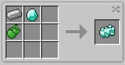
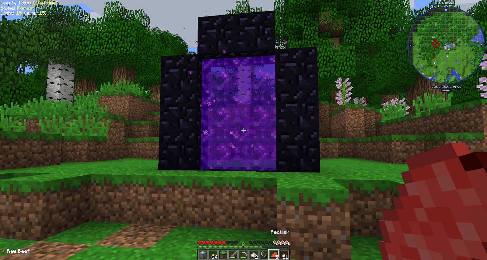
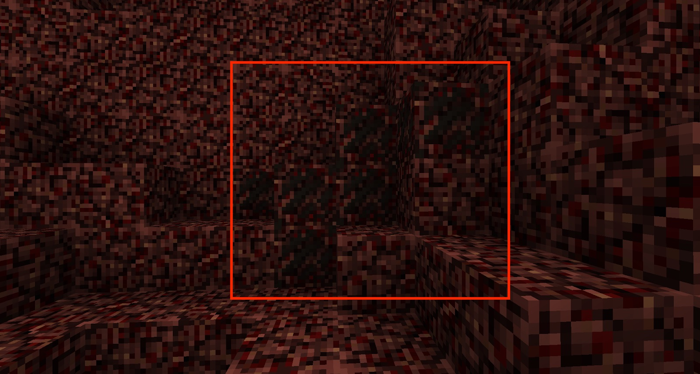

Now that you have a small supply of food, a place to call home and a lot of Hemp growing, you need to make your way to the Nether. You need a few materials (Nether Quartz and Netherrack) in order to get into automation fully.

Your first challenge is making a Diamond Pickaxe. After mining, you should have at least 3 Diamonds and a whole bunch of Iron. To make a Diamond Pickaxe, craft Diamond Ingots. These are crafted with 1 Diamond, 1 Iron Ingot and 1 Creeper Oyster. You will need a total of 27 Iron Ore to craft 1 Diamond Pickaxe.

When you craft Diamond Ingots, you will hear an explosion sound. This is normal and will not damage the surrounding area.

You can still get flint from Gravel, as long as you use a Shovel (Stone Shovel works). Once you l:have a Diamond Pickaxe, mine Obsidian and create your first Nether portal

Before you jump into the Nether, ensure you have some food and a weapon. As soon as you arrive in the Nether, look for a few blocks of Quartz, Netherrack, Soul Sand, Mushrooms (at least 1 of each) and Glowstone. Once you have these you can jump back into the Overworld. If you manage to get a stack of each of those materials (minus the mushrooms), then it would help mitigate the need to go back to the Nether again.

Remember that Quartz has been changed in BWM to a black texture:

