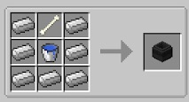
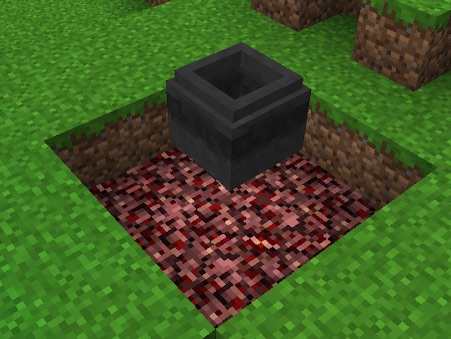
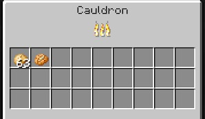

Now that you have been to the Nether, you can finally make use of Netherrack, and start cooking food and other materials without using coal. The Cauldron is not only used for cooking food, but it is also used for tanning Leather and crafting other materials.

The Cauldron is crafted with a bucket of water (you get an empty bucket back), a bone and Iron:

Once crafted, put it down **ABOVE** fire. The best practice for this is to have a 3x3x1 base of Netherrack, a space for the fire and then the cauldron in the middle:

This will not work with lava, but will work with 1 Netherrack instead of 9, it will just be slower. You can then light the Netherrack and throw in Potatoes to start cooking:

