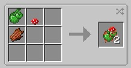

There is a simple way to remove stumps that is instant. By combining a Creeper Oyster, 1 Rotten Flesh and a Mushroom (red), you can create a stump remover. 

This is a single use item. While in hand, right-click a stump and it will instantly be destroyed, leaving behind Sawdust and Bark.