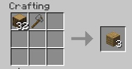

>>>> Be aware of what BWM has changed in Minecraft. Jumping into this mod without looking into what has changed may lead to frustration.

Like any new world in Minecraft, you want to find shelter and stockpile a few materials. Wooden tools only have one use, so try to get stone tools as quick as possible. You can no longer make wooden axes. Making a stone axe is very important as it will enable you to get wooden logs, rather than sawdust and 2 planks.

These logs can be turned into Planks by placing them into a crafting grid with an axe. You also get Bark and Sawdust as a by product:

When building your “house”, be aware that you can no longer jump and place blocks at the same time. It might be easier and quicker to build underground. Because you can't make doors yet, you will have to use blocks (dirt) to block the entrance to your house. 

Watch your hunger and be careful what you eat. If you eat too much you will become obese. When that happens, you won’t be able to jump and speed will be decreased. If you eat too little, you will be peckish and you will not be able to perform certain tasks such as using a crank.

