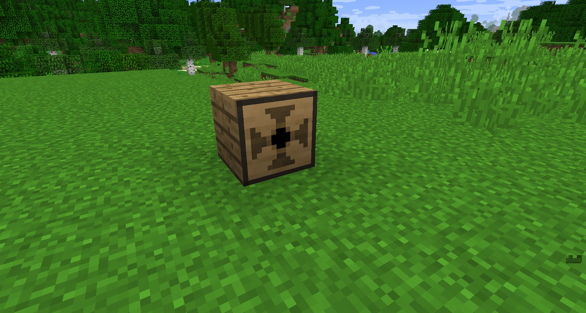

Gearboxes are used to transfer kinetic energy. They have 1 input and 5 outputs. They are susceptible to breaking, but can easily be fixed by right-clicking them with gears (2 gears are needed to repair one Gearbox). The face with 4 arrows is the input. This can be changed by sneak-right-clicking the Gearbox with an empty hand:

Gearboxes are cheap to craft and you will need a fair few.