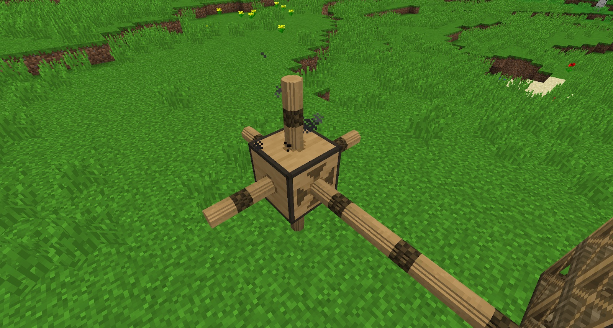
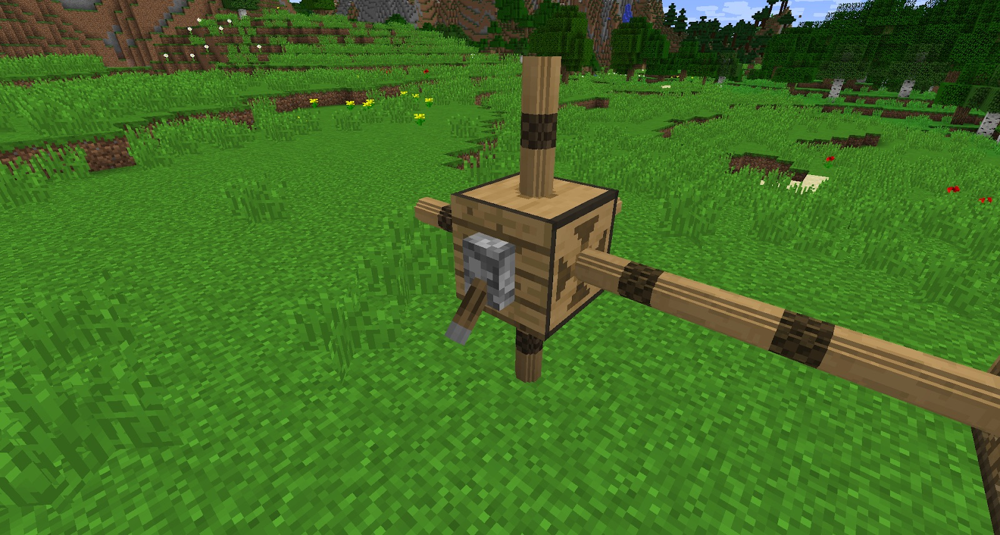

To move energy between Gearboxes, you need Axles. Each Gearbox can have Axles put on all 5 output faces, but you can only have 3 Axles between Gearboxes, any more than 3 will just force the Axle to break off. You will know when Axles are working because they will turn:

Axles require Hemp to craft. It is a good idea to step up your Hemp production. When the Gearbox is given a redstone signal, it will stop sending mechanical power, stopping all the Axles attached to it:

