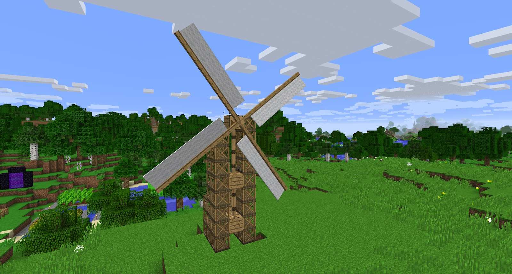
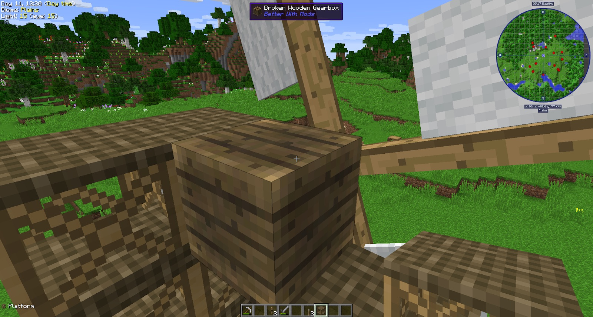

Gearboxes and Axles will be the main method to transport power to your machines. You need a contraption to generate power. The first method of creating power is a Windmill.

The Windmill needs 216 Hemp Fibers, which is a total of 72 Hemp plants. These need to be processed in the Mill Stone, crafted into cloth and then into Wind Sails. Wind Sails can be crafted with Slabs (any wood) to make the Windmill.

The Windmill needs a 13x13 area to work. You can check this by trying to put down the Windmill. If you get an error, the space is too small, and if not, it will be placed into the world. You need to put your Windmill down on an Axle. Ideally you want to attach this Axle to a Gearbox.

The Windmill will only work in the Overworld, and will only work above ground.

The Windmill is affected by rain. Do not place it down when it's raining; it will damage your Gearbox.

For now, it’s best if you run redstone from the Gearbox nearest the Windmill, with a lever. You will need to manually turn this off when it is raining, and turn it on again when it's clear.