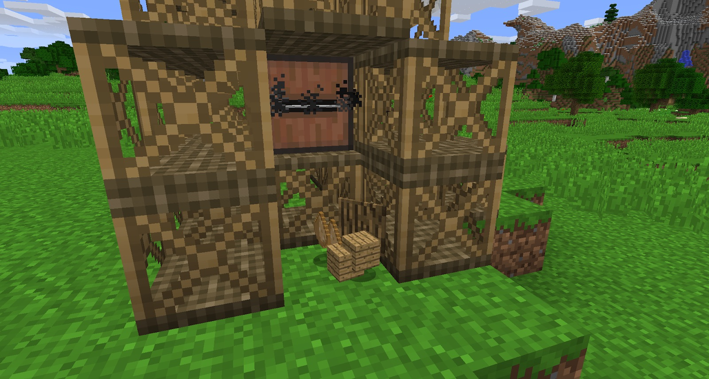

Now that you have some power, you can start using it. First, you should craft a Saw Mill. This can be crafted with Tanned Leather, which must be cut a few times with shears, and then crafted into a Leather Belt, and finally, into a Saw Mill. This Saw Mill must be automated (it cannot be used with the Hand Crank).

The Saw Mill can be powered from any side except the saw face:

You will know it’s working by the noise it makes while running, and the particle effects coming from the saw. Place blocks in front of the saw blade to cut them:

Placing a hopper (attached to a chest) below the saw will cut down on the amount of entities in the world. Cutting Logs and Wood will result in the following:

* Wood
	* 4 Planks
	* 2 Sawdust
	* 1 Bark
* Planks
	* 2 Plank Siding
* Siding
	* 2 Plank Moulding
* Moulding
	* 2 Plank Corners
* Corners
	* 2 Gears
