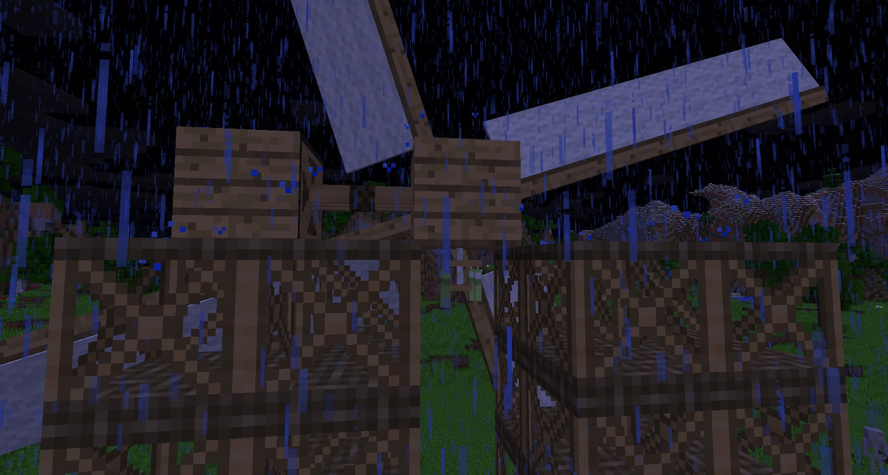

Siding, Moulding and Corners are all used in crafting recipes. More importantly, wood Moulding can be used to make Wind Chimes. Wind Chimes are used to detect rain or entities that pass through them. Once they detect an entity or rain, they will give off a redstone signal.

Place one of these below the Gearbox that is nearest to the Windmill. This will turn off the Gearbox when it rains and prevent it from breaking:

