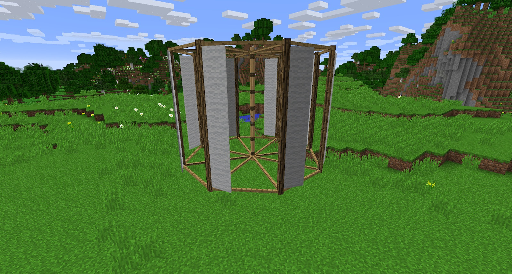

Because the Windmill only works above ground and in the Overworld, you will have problems trying to power machines underground and in other dimensions. Lucky, you can craft a Vertical Windmill. Unlike the standard Windmill, the Vertical Windmill only needs a space of 9x7x9.

The Vertical Windmill is twice as expensive as its predecessor, costing 4 more sails (432 Hemp Fibers or a 144 Hemp plants).

Before you can put the Vertical Windmill down, you will need to stack 7 Axles. This is the only time that stacking more than 3 Axles works or is needed.

With the Vertical Windmill in hand, right-click one of the Axles. This will place it into the world, and it will start spinning. If you are unable to place it into the world, it means you do not have enough clearance for it to work, or too few Axles.

You can run Gearboxes from either the top or from the bottom of the Vertical Windmill. You will not be able to run additional Axles off the Vertical Windmill, you must first place a Gearbox.

The vertical Windmill is also affected by rain. To avoid breaking the Gearboxes attached, you need to ensure they are powered off (automatically or manually) when it rains.