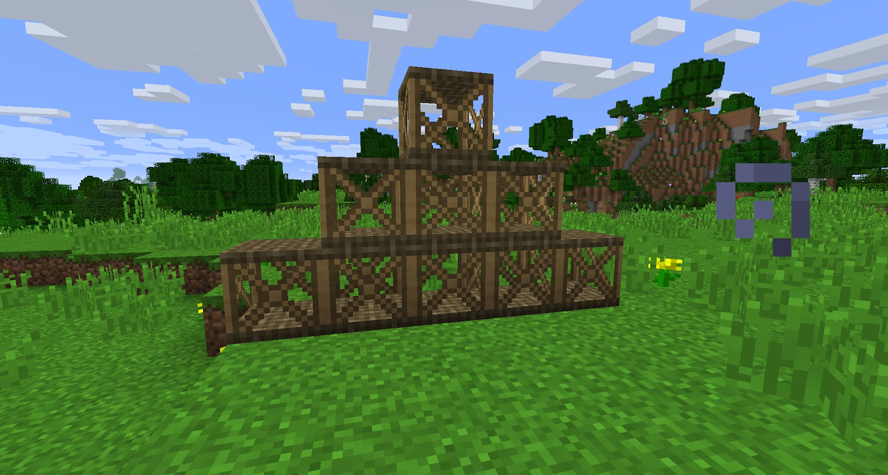

Platform blocks are very handy when building. They are climbable, making them brilliant as scaffolding when building bigger structures:

These do not work like the old scaffolding in IC2, they act just like normal blocks and do not obey gravity.