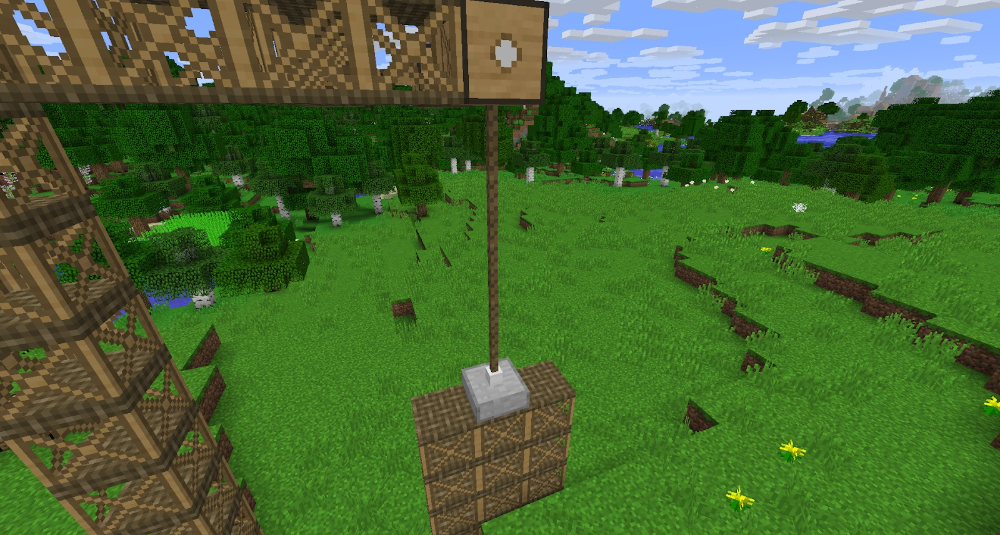
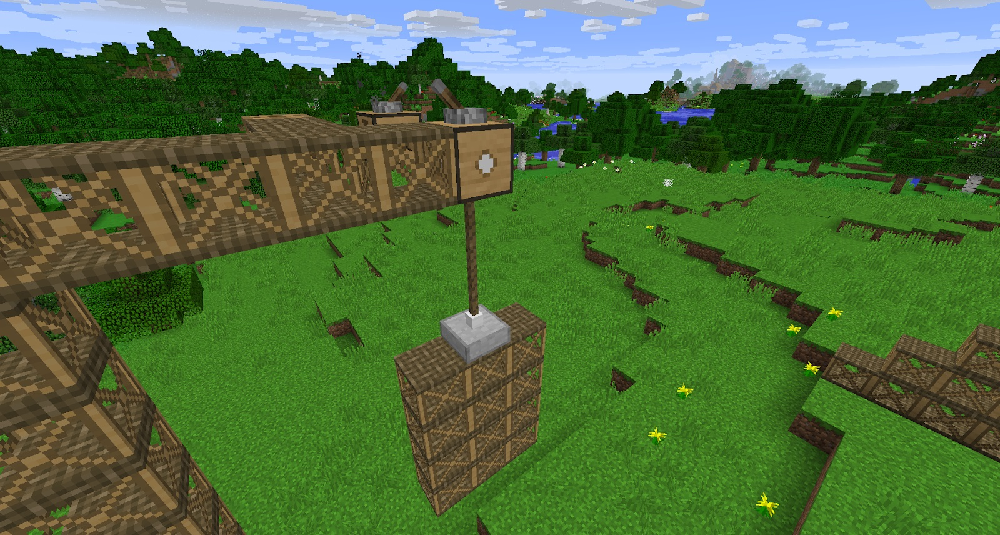

The Pulley and Anchor work hand-in-hand with each other. If set up correctly, you can lift certain blocks (such a Platforms), and have them work as a sort of door, or even a lift platform.

The Anchor needs to be placed on blocks that it will “stick” to, such as Platforms, Iron Walls and Well Buckets. The Anchor can pull groups of blocks (there is no limit from what we have tested).

The Pulley needs to be set directly ABOVE the Anchor. It doesn't matter too much how far above the Anchor the Pulley is, but you need to be able to give the Pulley power, and you also need to give it a supply of rope (you need to have enough rope so that it reaches the Anchor). When you add 1 rope into the Pulley (right-click to open its GUI or right click with Rope in hand) it will descend 1 block. Keep adding rope until the rope reaches the top of the Anchor. It will then attach itself to the Anchor.

Powering the Pulley with Axles and Gearboxes will cause it to wind up the rope, pulling whatever is attached to the Anchor up. This will keep going until the Pulley meets the Anchor, or whatever is attached to the Pulley collides with a solid block (this does not include Platforms or Iron Walls). Giving the Pulley a redstone signal will stop the platform from going up. Stopping the signal will make the Pulley continue pulling the Anchor up. Turning the Gearbox off will make the Anchor descend until it hits a solid block.

In brief, turning the Gearbox on will make the Pulley pull the Anchor, and turning the Gearbox off will drop the Anchor. With the Gearbox on and the Pulley turned off, the platform will stop descending. 

You can get VERY creative with Pulleys and Anchors.

