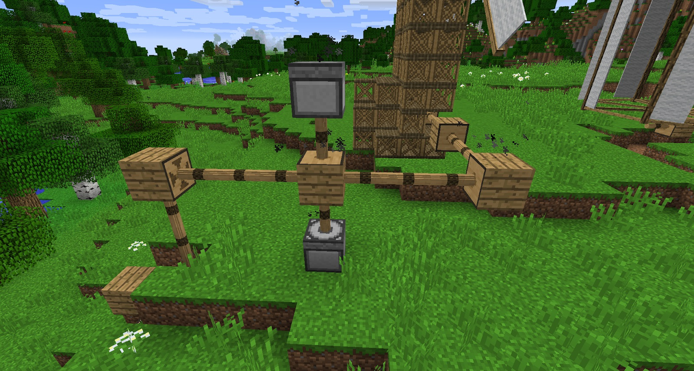

You can now use Axles to power the Mill Stone. Ensure that the Mill Stone has Axle either going into the top or into the bottom. Automating the Mill Stone will help you grind up Hemp or any other materials. It is advisable to turn off the Gearbox nearest to the Mill Stone so you can turn it off when not in use, as the noise can be very loud (unless you have sound off).

You can tell your Mill Stone is powered by the particles coming from the top of it:

