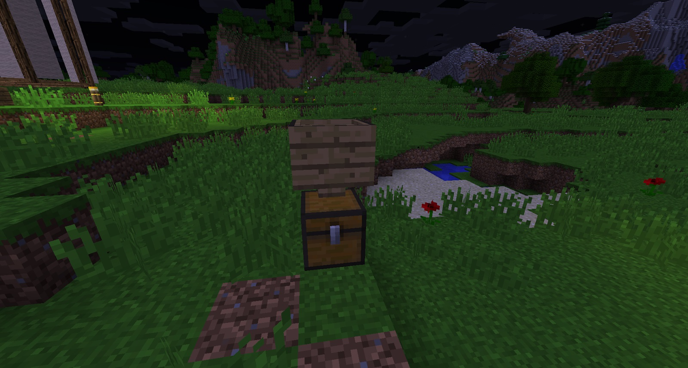
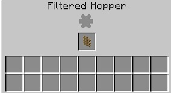
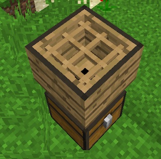

The hopper is used to filter ground up materials, and can also be used to sort items. It will be essential in the future. The most important thing, above anything else, is to know that you can power it. The type of filter inserted will change the hopper’s behaviour.

When put into the world, hoppers act a little like vanilla hoppers. BWM hoppers have a bigger inventory (17 slots), and when you put items into them (without powering them and with no filters attached), the items will go into the hopper’s inventory. As soon as you power the hopper, the items will drop out of the hopper’s inventory and into any inventory chest it’s attached to.

Hoppers can also have filters added to them. This means you can fill hoppers or inventories with specific kinds of items. These filters need to be inserted into the top slot of the Hopper:

Once added to the hopper, filters will change the look of the hopper:

