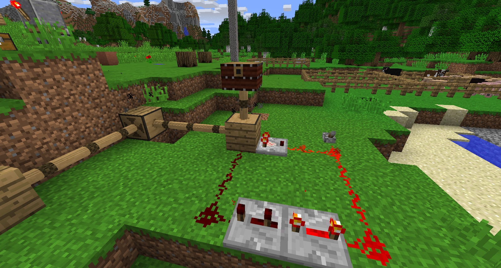
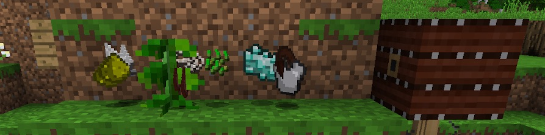

The Bellows have 2 uses. To stoke Hibachi ovens (more on these [here](https://minecraftguides.net/BWM/advanced-cooking/hibachi-oven)), and to move items (sounds mad but it's true). In order for Bellows to correctly function, they need to be powered from below, but the power needs to be pulsed by a redstone clock. You need to point the Bellows in the correct direction; this can be changed by sneak-right-clicking on them with an empty hand. Bellows can also stoke a 3x3x1 area of Hibachi ovens.

If the Bellows are given constant power that is not on a clock, they will compress and stay in that position. With a redstone clock, they will continue to inflate and deflate. You can change the speed of this via the clock (this can be very noisey). 

Now that the Bellows are on a clock and facing the right way, you can also use them to move items. The distance that the Bellows can move the items depends on the theoretical weight of the items. Light items will go further and heavy items will not.

* Light items will travel 3 blocks: 
	* String, Feathers, Paper
* Medium Weight items will travel 2 blocks:
	* Seeds String, Dusts
* Heavy items will travel 1 block:
	* Iron Armor, Ingots, Ore

With this in mind, it is possible to sort out drops from a mob farm or a sugarcane farm. Playing around with items is advised.
