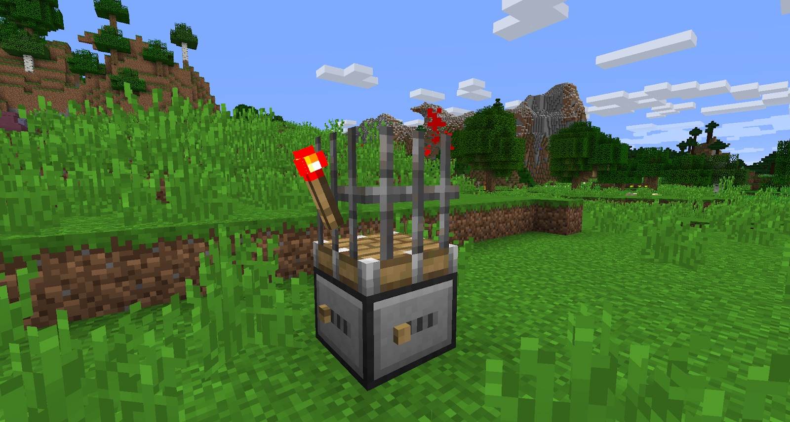
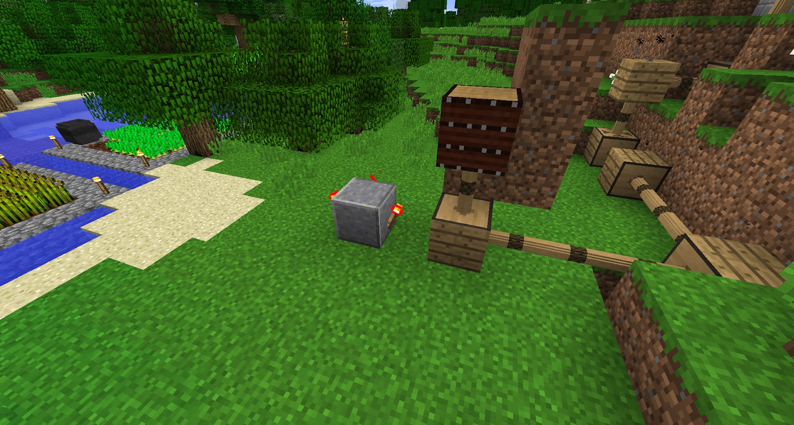
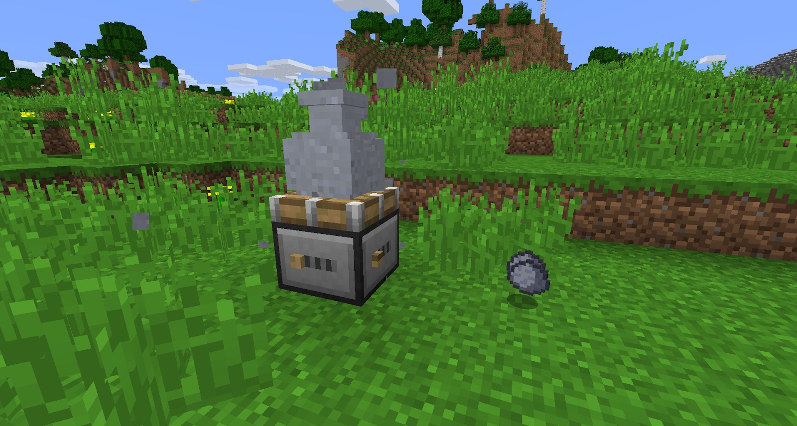

The Turntable is another multi-use block that is very important for progression. When placed down and given power (to the bottom of the block), it will start turning. With nothing on the Turntable, it is not easy to see if it is working, but you will hear it turning. 

You can place any block on top of the Turntable and it will rotate. Only the FIRST block on top of the Turntable will rotate. Items attached to any block on top of the Turntable will stay attached and will also spin; this includes rails, redstone torches, and torches:

The button on the bottom of the Turntable can be moved left and right (by right-clicking it). This will determine the speed of the Turntable (left is faster, and right is slower). Used like this, the Turntable can be made into a clock with very minimal redstone:

The Turntable is also used to make pottery, such as: Unfired Crucible, Unfired Planter, Unfired Vase, and lastly, Unfired Urn. To make any of these, you need to set the Turntable to slow and place a clay block on top of it. As the Turntable spins, it will change the clay block; first, into an Unfired Crucible, then an Unfired Planter, then an Unfired Vase, and last, an Unfired Urn. Each transformation will throw off clay, and will give you enough time to break the desired block off:

The Unfired Crucible and Unfired Planter take 3 Clay, the Unfired Vase uses 2, and the Unfired Urn uses 1 clay so you will get the remaining clay back as its thrown off the Turntable. Leaving the Turntable running past the Urn will get you 4 clay back.

If you leave it turning without removing any of the unfired blocks, it will leave behind 4 clay.

These unfired items can be placed in the world, but they will only become useful if you fire them in a Stoked Kiln.
