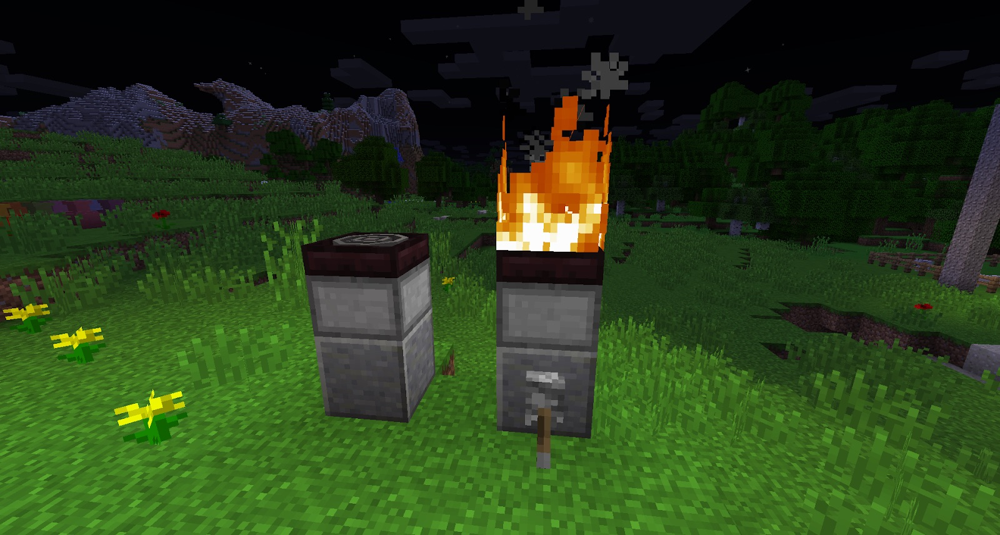
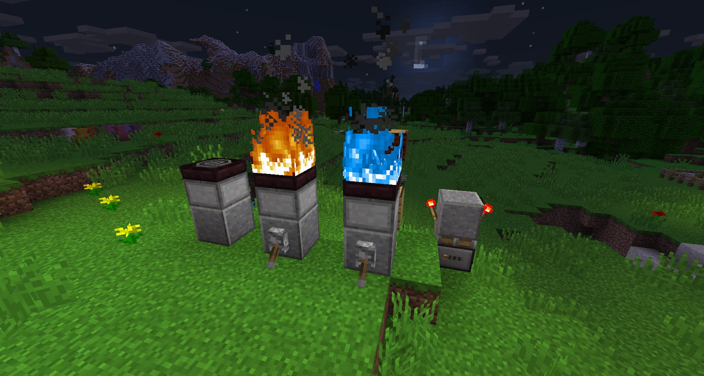

The Hibachi Oven is essential towards the end of this mod. It enables you to crafter stronger armor and gives you access to more advanced versions of machines.

By filtering Netherrack Dust in a POWERED Filtered Hopper (with Soul Sand), you will get Hellfire Dust. 8 Hellfire Dust can be smelted in a Cauldron, which will give you 1 Concentrated Hellfire. You need at least 3 of these in order to build one Hibachi Oven (we recommend making 9+ ovens). You also need a Heating Element, which can be made with String, Redstone and Blaze Powder in a Cauldron.

The Hibachi oven can be turned on by giving it a redstone signal. When the redstone signal is turned off, it will also turn off:

These ovens can be stoked with Bellows, increasing the heat of the fire, and give you a “_Stoked_” fire that has a blue flame:

There is a huge difference between stoked and normal fire. Stoked fires will not work the same as normal fire.
