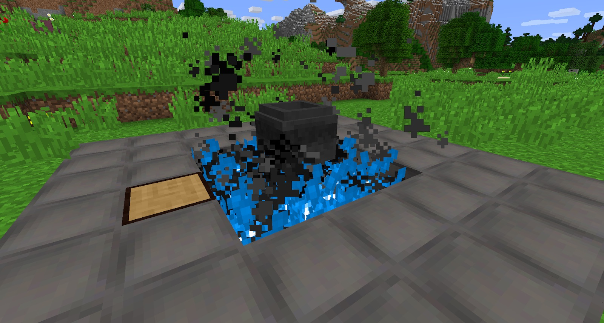

Putting 9 Stoked Hibachi ovens below a Cauldron will change what the cauldron can craft. This is now classed as a Stoked Cauldron. You can have seperate Cauldrons for stoke and normal fire (which we recommend), but you can also just have an on/off switch for the Bellows:

Normal Cauldron recipes will not work in a Stoked Cauldron. Instead, it has its own set of recipes. The most important thing with the Stoked Cauldron is that it allows you to craft Glue (from Leather items), Tallow (any kind of food), Potash and Soap.