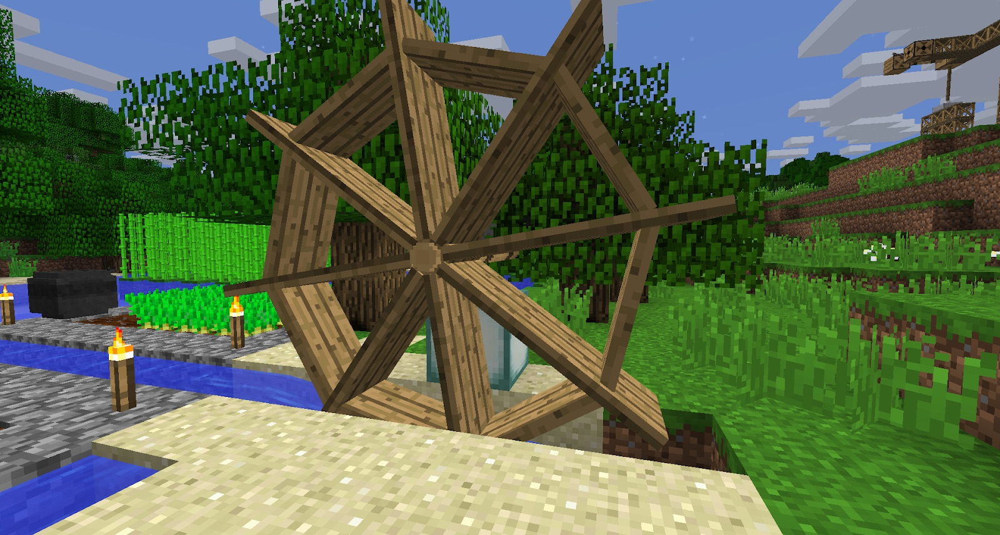

Now that glue is accessible via the Stoked Cauldron, you can craft a Water Wheel. This is another method of generating power, but it's far more compact, works underground and does not need to be turned off when the weather is bad:

The Water Wheel needs to be placed onto an Axle, in a 5x5 area with water flowing below it.

