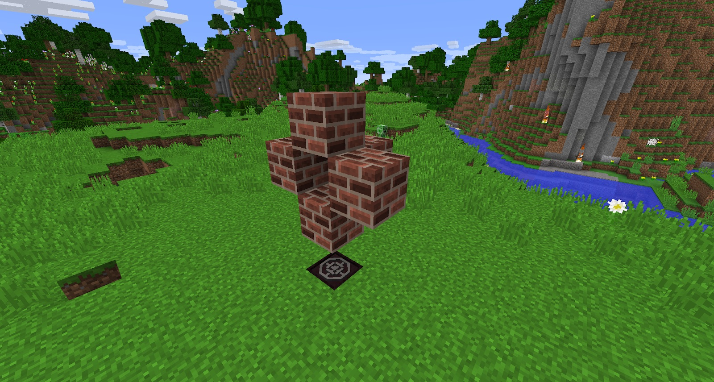

The Stoked Kiln will enable you to not only fire pottery, but create Charcoal, iron and Endstone.

The Kiln is crafted with 5 Bricks:

For the Kiln to work, you need to have a stoked fire below it:

Items such as pottery, Logs and Ore can be placed in the hole in the middle. These will then look like they are breaking (they are in fact cooking). Once “broken” they will be cooked and ready for collection:

You can make the Kiln as long as you like, provided it has a fire below its entire length:

The Kiln allows you to cook EndStone, giving you Ender Slag and White Cobble. While White Cobble is another decorative block, the Ender Slag is very important for crafting Soul Forged Steel.