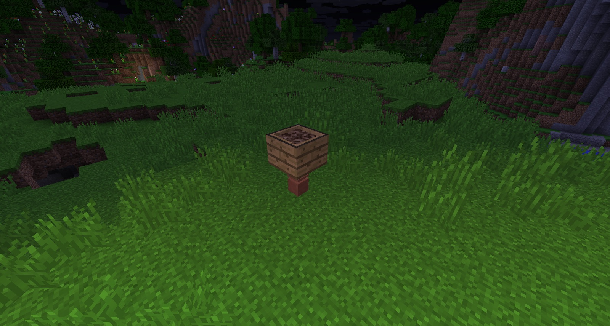
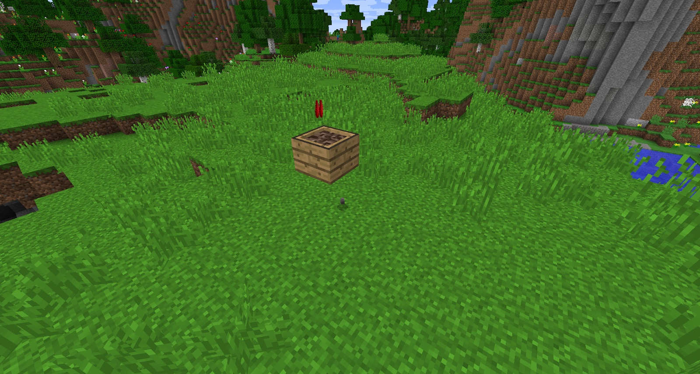

The Soul Urn is made by tuning clay on a Turntable. This gives you an unfired Urn, which must then be fired in a Kiln. Once fired, you will get a normal Urn. To turn this into a Soul Urn, you need to capture Souls; each Urn can hold 1 Soul.

To capture a Soul, attach an Urn onto the bottom of an unfiltered Hopper. The hen insert a Soul Sand filter  into the Hopper:

The next step is **VERY** important. To convert the Urn into a Soul Urn, throw 8 Ground Netherrack into the Hopper.

It's important to know that after every 8 Netherrack Dust is thrown in, a Ghast will spawn into the overworld (or whatever world you are in). This happens if there is no Urn under the Filtered Hopper, or if the Filtered Hopper is not powered. You can use Void Urns that will void all the Souls, and not cause ghasts to spawn.

Once 8 Ground Netherrack has passed through the filter, a Soul Urn will detach:

