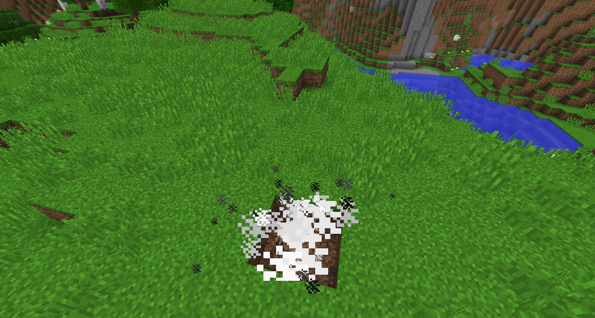

Blasting Oil can be made from Tallow (made from any meat in a Stoked Cauldron). When dropped into the world, it will explode and break a few blocks (so be careful). Blasting oil can also be put into Vase’s, which will explode when broken:

It can also be used to craft Dynamite (this requires some Paper and an Explosive Fuse). Dynamite is much more stable than Blasting oil. It can be thrown (right-click while in hand), and after about 7 seconds, it will blow up. The explosion is a lot smaller than TNT, but can be thrown down caves or at monsters. Dynamite can also be thrown into water, after it explodes fish will float to the surface.

