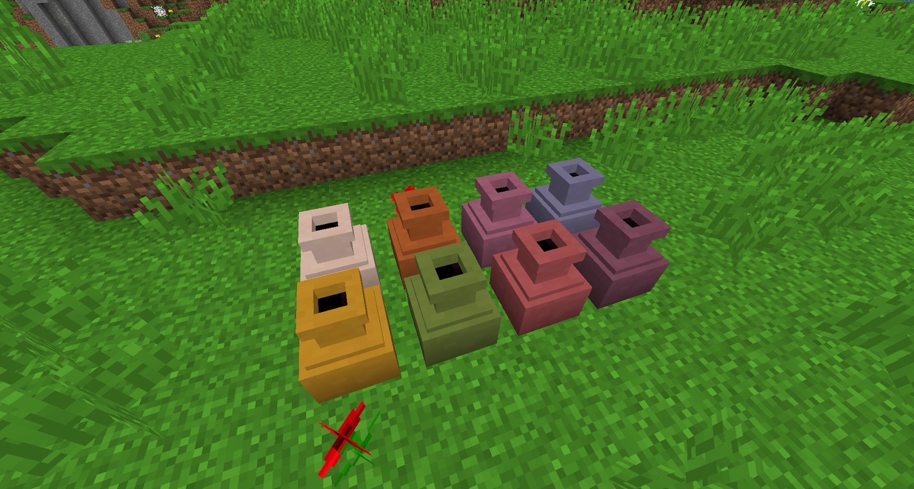

The Vase is crafted on a Turntable with clay. It is the 3rd item (out of 4) that is made by the Turntable. After turning, it needs to be fired in a Stoked Kiln. The Vase is largely a decorative item that can be coloured, and can store 1 type of item (that you can only retrieve by breaking the Vase):

