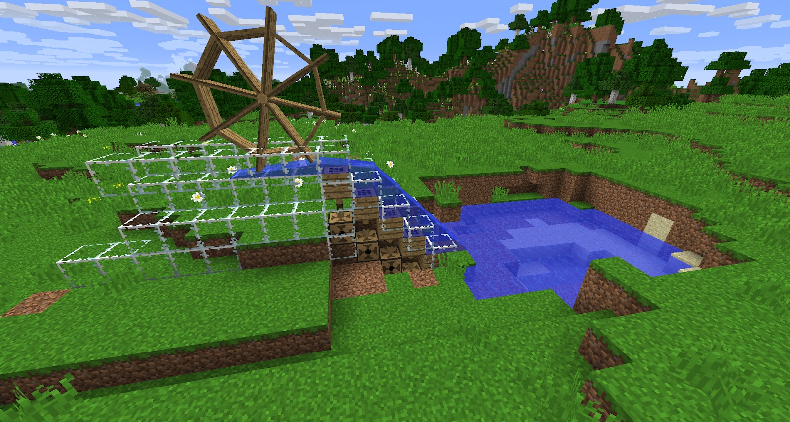

When the Screw Pump is powered, it will pull water that is in front of it up. This can be used to get water uphill. It will not pulla whole water source, and does not need a water source to pull water up. It is most useful when creating Viaduct channels:

