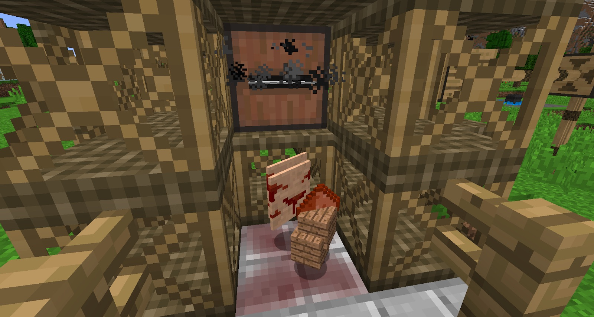

The Bloodwood Sapling is like no other sapling. Not only is it not found in the wild, but when it's planted in the Nether, it will grow until there is no more room to grow. This will not happen in the Overworld.

The Bloodwood Sapling is made in the Cauldron with 1 of every vanilla sapling, along with 8 Soul Urns. This sapling can only be planted on Soul Sand, and Bone Meal can’t be used to force it to grow. To force them to grow, throw a Soul Urn onto them.

Once the sapling has grown, you can harvest its wood, which should be processed with the Saw Mill, giving you Soul Dust.

