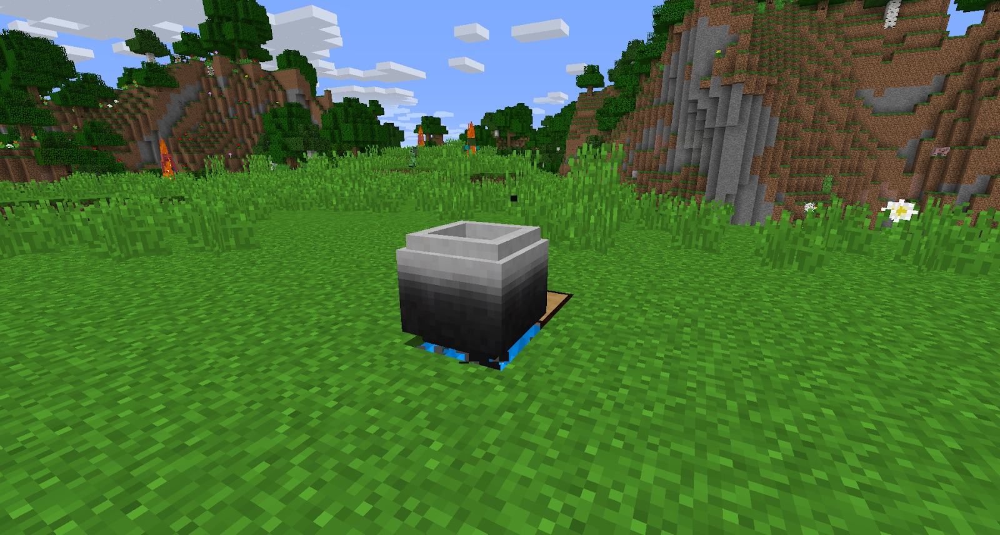

The Stoked Crucible will only work with a stoked fire. If the fire is not stoke, then it won’t work. 

The Stoked Cauldron is essential when it comes to recycling tools and weapons that you find. The best thing about this Cauldron is that it will return the metal materials used to craft tools, weapons and armor.

The Stoked Cauldron requires a minimum of 1 stoked fire below it, but you can speed this up by putting it above 9 (3x3x1).

This works with all vanilla tools, weapons and items (such as buckets), but it also works with tools and armor from BWM.

More importantly, Stoked  Crucible will allow you to craft Soulforged Steel.
