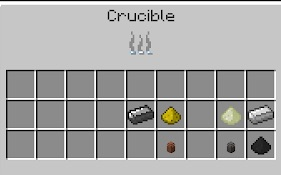

Soulforged Steel is a material that is a step up from Diamonds, and is considered endgame BWM material. Made in a Stroke Crucible with Iron, Ender Slag, Charcoal Dust and a Soul Urn, this returns 1 Soulforged Steel Ingot.

Creating Soulforged Steel can be a long process because you need to have a lot in place in order to make it at a steady pace.