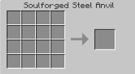
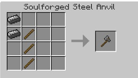

Now that you have access to Soulforged Steel, the first thing that you should craft is the Soulforged Steel Anvil. It is created with 7 Soulforged Steel. The vanilla Anvil has been disabled in BWM.

The Anvil is much like a crafting table, but can only make items with Soulforged Steel;it is a 4x4 grid.

Unlike Iron or Diamond Tools, you need to craft all your Soulforged Steel tools and armor in the Anvil. You can no longer use sticks as the shafts for your tools and weapons. Instead, use Hafts, created with Glue, Wood Molding and a Leather Strap:

Soulforged Steel blocks are also created in the Anvil, each of which requires 16 ingots:

There are a few blocks that can only be created in the Anvil, such as the Block Dispenser, Buddy Block and the Detector Block.
