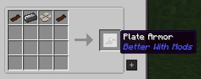

Soulforged Steel armor is not only made within the Soulforged Steel Anvil, but has a much higher material cost and slows you down when wearing it. It has the positive trade off of higher durability than any other armor.

In addition to Soulforged Steel, you need Plate Armor. Generally, you need around 2 per armor craft, but this depends on the item you are crafting:

Diamond Armor will give you +20 Armor and will have 1819 total durability. Soulforged Steel Armor give you 32 Armor and has a total Durability of 2200 durability.

The Refined Armor can only be enchanted via the Infernal Enchanter.
