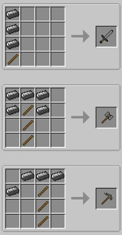
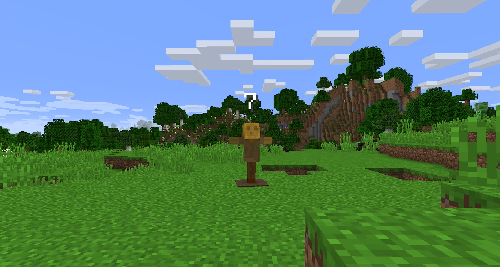

Both Soulforged Steel Weapons and Tools must be crafted within the Soulforged Steel Anvil. These tools do not have a traditional crafting recipe, and also require Hafts, rather than sticks.

There are, however, 3 tools that stand out. These are the Refined Battle Axe, the Mattock and the Hacksaw.

The Battle Axe can be used to kill enemies, and gives you a higher chance of collecting heads. It can also be used to cut down trees.

The Mattock can be used to till the ground, make paths and can be used as a shovel.

The Hacksaw can be put into a crafting table with wood to give you 3 planks.

The Refined tools have a Durability of 2250, which is much higher than Diamond tools. These tools can be repaired by combining 2 of the same type (one almost broken and 1 new one) in a crafting table. However, this removes their enchants. The Sword does the same amount of damage as its Diamond counterpart, but the Battle Axe does 5 normal damage which is 1.5 more than the Sword.

The Composite Bow can be crafted. Although the bow itself does not require any Soulforged Steel, the arrow heads do. The Composite Bow shoots further than the vanilla bow, and when combined with Broadhead Arrows, does a lot more damage. The vanilla bow does around 4 damage with vanilla arrows, whereas the Composite Bow, with Broadhead Arrows, does around 7.

You can still use normal arrows with the Composite Bow.

Finally, the Refined Tools and weapons can only be enchanted via the Infernal Enchanter.

