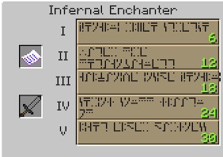

The Infernal Enchanter is used to enchant weapons and armor. You still need to surround it with bookcases (17x17x17 area), and you still need the correct amount of levels for each enchant.

The Infernal Enchanter differs from the vanilla Enchanter because it needs scrolls. These scrolls have different enchants for different items. This means you can pick which enchant you want on what item. Depending on your levels, you can also pick the strength of each enchant. These scrolls are dropped from mobs and are single use only.

As more enchants are used, the more books and levels you need.