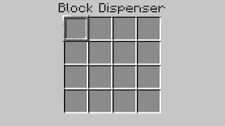
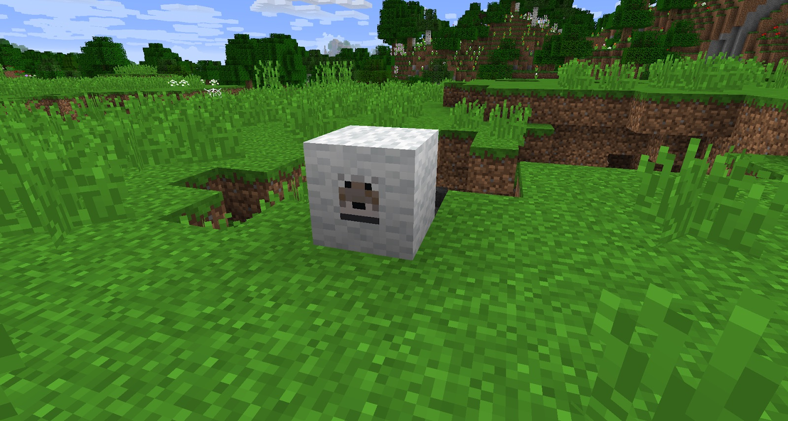

Unlike the vanilla Dispenser, the Block Dispenser can do more than just place down blocks. The Dispenser has a larger inventory, with a highlighted slot, which shows its current selected item. When it is triggered, it will use that item or place that block. When a block is placed, it can be sucked back into the Dispenser when the redstone signal is lost.

It can suck in friendly mobs such as chickens and wolves. 

It has a variety of other uses:
* Silk touches Smooth Stone.
* Throw Dynamite from its inventory.
* Place Mining Charges that have gravity when facing downward.
* Take the wool off of Sheep.
* Milk a Cow with a bucket.

