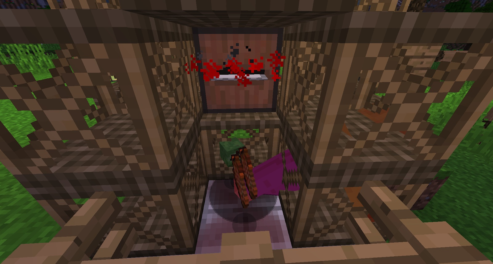

The Chopping Block is made with stone on the Soulforged Steel Anvil. It is a block that, when paired with the Saw Mill, increases the chance of getting heads from mobs. All that is required is that a mob has to be killed ON it (not beside it or near it, ON IT). The more mobs that die on the chopping block, the bloodier it will get (this is  just aesthetic). It can be washed with soap to “clean” it:

