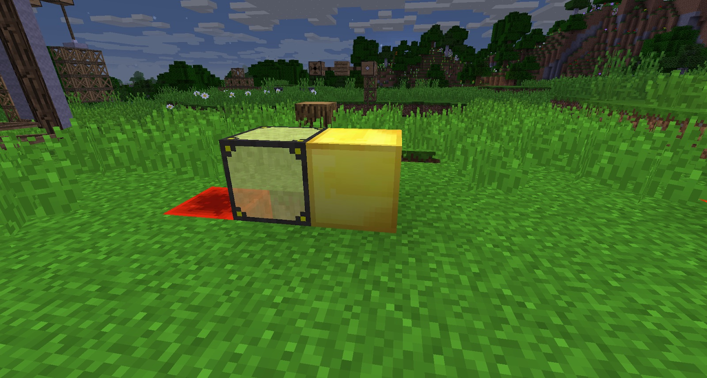

The Lens and Detector work hand-in-hand, but they can also be used separately. When set up together, they can enable you to carry redstone signals 256 blocks. This can be lengthened even more with additional pairs of Lenses and Detectors.

Lenses have 1 input and 1 output. By putting a light directly on the Grey side (the input), the output will emit a light (invisible) that can travel up to 256 blocks. The light source must be over 12, so torches will not work. Ensure that nothing is blocking the way (including grass):

The Detector sends out a redstone signal whenever anything is in front of it. This includes blocks, mobs, the player and Light Signals from the Lens. It will also emit a redstone signal if it is facing up when it is raining.

